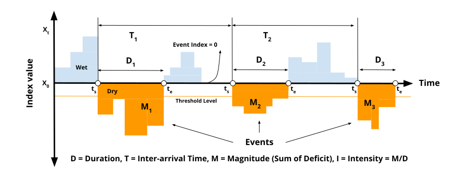

# Climate Extremes Analysis - Run Theory

## Overview

Run theory provides a framework for analyzing climate extreme events based on continuous periods beyond a threshold. This package implements comprehensive event analysis for **both drought (dry) and wet (flood/excess) conditions** with three operational modes.

**Based on:** Yevjevich (1967) run theory
**Applies to:** Both dry events (drought) and wet events (flooding/excess precipitation)
**Provides:** Event identification, time-series monitoring, period statistics

## 📘 Important Note on Terminology

> **All functions are neutral and work for both dry and wet extremes.** This guide uses "drought" in some examples for historical consistency with run theory literature, but the same functions and concepts apply to wet events by simply using positive thresholds instead of negative ones.

**Threshold Direction:**

- **Negative threshold** (e.g., -1.2): Identifies **dry events (drought)**
- **Positive threshold** (e.g., +1.2): Identifies **wet events (flooding/excess)**

The mathematics and event characteristics (duration, magnitude, intensity, peak) work identically for both extremes.

## Run Theory Concept



**Figure 1: Run Theory Applied to Climate Extremes**

This illustration demonstrates run theory using **dry events (drought)** as an example, where events occur when the index falls **below** the threshold (x₀). 

**⚠️ Important:** The same framework applies identically to **wet events (flooding/excess)** by using a **positive** threshold—wet events occur when the index rises **above** the threshold. The mathematics, algorithms, and characteristic calculations remain unchanged.

Key characteristics:

- **Duration (D)**: Length of continuous period beyond threshold (D₁, D₂, D₃)
- **Magnitude (M)**: Total accumulated deviation from threshold (M₁, M₂, M₃)
- **Intensity (I)**: Average severity per time unit = M/D
- **Inter-arrival Time (T)**: Time between consecutive events (T₁, T₂)

The "Wet" and "Dry" regions are labeled to show that both extremes can be analyzed using the same methodology.

---

## Three Modes of Analysis

### Mode 1: Event-Based Analysis

**Purpose:** Identify and analyze complete climate extreme events

```python
from runtheory import identify_events

events = identify_events(spi_ts, threshold=-1.2, min_duration=3)
# Returns: DataFrame with one row per event
```

**Use for:** Historical analysis, event comparison, detailed investigation

### Mode 2: Time-Series Monitoring

**Purpose:** Month-by-month tracking with varying characteristics

```python
from runtheory import calculate_timeseries

ts = calculate_timeseries(spi_ts, threshold=-1.2)
# Returns: DataFrame with one row per time step
```

**Use for:** Real-time monitoring, drought evolution tracking, operational systems

### Mode 3: Period Statistics (Gridded)

**Purpose:** Answer "What happened in 2023?" or "2021-2025?"

```python
from runtheory import calculate_period_statistics

stats = calculate_period_statistics(spi, threshold=-1.2,
                                    start_year=2020, end_year=2024)
# Returns: xarray Dataset with (lat, lon) dimensions
```

**Use for:** Decision-making, reporting, regional analysis, mapping

## Quick Start

### Drought (Dry) Events

```python
import xarray as xr
from runtheory import identify_events, calculate_period_statistics
from visualization import plot_events

# Load SPI
spi = xr.open_dataset('output/netcdf/spi_12.nc')['spi_gamma_12_month']

# Drought events (negative threshold)
spi_location = spi.isel(lat=50, lon=100)
dry_events = identify_events(spi_location, threshold=-1.2)
print(f"Found {len(dry_events)} drought events")

# Gridded drought statistics
drought_stats = calculate_period_statistics(spi, threshold=-1.2,
                                            start_year=2023, end_year=2023)
drought_stats.num_events.plot(title='Drought Events 2023')
```

### Wet (Flood/Excess) Events

```python
# Wet events (positive threshold) - SAME FUNCTIONS!
wet_events = identify_events(spi_location, threshold=+1.2)
print(f"Found {len(wet_events)} wet events")

# Gridded wet event statistics
wet_stats = calculate_period_statistics(spi, threshold=+1.2,
                                        start_year=2023, end_year=2023)
wet_stats.num_events.plot(title='Wet Events 2023')
```

**💡 Key Point:** Same functions, different thresholds:

- **Drought:** `threshold < 0` (e.g., -1.2, -1.5, -2.0)
- **Wet:** `threshold > 0` (e.g., +1.2, +1.5, +2.0)

## Drought Characteristics

| Characteristic | Formula | Meaning |
|----------------|---------|---------|
| **Duration (D)** | end - start + 1 | Months in drought |
| **Magnitude (Cumulative)** | Σ(threshold - SPI) | Total water deficit |
| **Magnitude (Instantaneous)** | threshold - SPI[t] | Current severity |
| **Intensity (I)** | Magnitude / Duration | Average severity |
| **Peak (P)** | min(SPI) | Worst moment |
| **Inter-arrival (T)** | start[n+1] - start[n] | Time between events |

### Magnitude: Two Types

**Cumulative** (blue in plots):

- Total accumulated deficit
- Always increases during drought
- Like debt accumulation
- Use for: Total impact, event comparison

**Instantaneous** (red in plots):

- Current month's severity
- Varies with SPI (rises-peaks-falls)
- Like NDVI crop phenology
- Use for: Monitoring evolution, peak detection

See [Magnitude Explained](magnitude.md) for detailed comparison.

## Mode 1: Event-Based Analysis

### Basic Usage

```python
from runtheory import identify_events

# Single location
spi_ts = spi.isel(lat=50, lon=100)
events = identify_events(spi_ts, threshold=-1.2, min_duration=3)

print(events)
# Columns: event_id, start_date, end_date, duration, magnitude,
#          intensity, peak, peak_date, interarrival
```

### Event Summary Statistics

```python
from runtheory import summarize_events

summary = summarize_events(events)
print(f"Total events: {summary['num_events']}")
print(f"Mean duration: {summary['mean_duration']:.1f} months")
print(f"Max magnitude: {summary['max_magnitude']:.2f}")
print(f"Most severe peak: {summary['most_severe_peak']:.2f}")
```

### Visualization

```python
from visualization import plot_events, plot_event_characteristics

# Timeline with events highlighted
plot_events(spi_ts, events, threshold=-1.2)

# Event characteristics analysis
plot_event_characteristics(events, characteristic='magnitude')
```

## Mode 2: Time-Series Monitoring

### Real-Time Tracking

```python
from runtheory import calculate_timeseries

ts = calculate_timeseries(spi_ts, threshold=-1.2)

# Check current status
current = ts.tail(1)
if current['is_drought'].values[0]:
    print(f"IN DROUGHT")
    print(f"Duration: {current['duration'].values[0]} months")
    print(f"Cumulative magnitude: {current['magnitude_cumulative'].values[0]:.2f}")
    print(f"Current severity: {current['magnitude_instantaneous'].values[0]:.2f}")
else:
    print("Not in drought")
```

### Monitoring Evolution

```python
# Is drought worsening or easing?
recent = ts['magnitude_instantaneous'].tail(3)
if recent.is_monotonic_decreasing:
    print("EASING - severity decreasing")
elif recent.is_monotonic_increasing:
    print("WORSENING - severity increasing")
```

### Visualization

```python
from visualization import plot_event_timeline

# Shows both cumulative and instantaneous magnitude
plot_event_timeline(ts)
```

## Mode 3: Period Statistics

### Specific Time Period

```python
from runtheory import calculate_period_statistics

# What happened in 2023?
stats_2023 = calculate_period_statistics(spi, threshold=-1.2,
                                         start_year=2023, end_year=2023)

# Map number of events
stats_2023.num_events.plot(cmap='YlOrRd')

# Map worst severity
stats_2023.worst_peak.plot(cmap='YlOrRd_r')
```

### Year-by-Year Analysis

```python
from runtheory import calculate_annual_statistics

# Calculate for each year
annual = calculate_annual_statistics(spi, threshold=-1.2)

# Access specific year
stats_2015 = annual.sel(year=2015)

# Trend over time
annual.num_events.mean(dim=['lat', 'lon']).plot()
```

### Period Comparison

```python
from runtheory import compare_periods

# Compare decades
comparison = compare_periods(
    spi,
    periods=[(1991, 2000), (2001, 2010), (2011, 2020), (2021, 2024)],
    period_names=['1990s', '2000s', '2010s', '2020s']
)

# Calculate change
diff = comparison.sel(period='2020s') - comparison.sel(period='1990s')
diff.num_events.plot(title='Change in Events: 2020s vs 1990s', cmap='RdBu_r')
```

## Output Variables (Period Statistics)

All period statistics functions return xarray Dataset with:

| Variable | Description | Units |
|----------|-------------|-------|
| `num_events` | Number of drought events | count |
| `total_drought_months` | Total months in drought | months |
| `total_magnitude` | Sum of all event magnitudes | index units |
| `mean_magnitude` | Average magnitude per event | index units |
| `max_magnitude` | Largest single event | index units |
| `worst_peak` | Most severe SPI/SPEI value | index units |
| `mean_intensity` | Average intensity | index units/month |
| `max_intensity` | Maximum intensity | index units/month |
| `pct_time_in_drought` | % of time in drought | % |

## Decision-Maker Questions

### "How many drought events in 2023?"

```python
stats_2023 = calculate_period_statistics(spi, start_year=2023, end_year=2023)
stats_2023.num_events.plot(title='Drought Events in 2023')
```

### "Where was the worst drought in last 5 years?"

```python
stats = calculate_period_statistics(spi, start_year=2020, end_year=2024)
stats.worst_peak.plot(title='Worst Severity 2020-2024', cmap='YlOrRd_r')
```

### "How does recent compare to historical?"

```python
comparison = compare_periods(spi,
    periods=[(1991, 2020), (2021, 2024)],
    period_names=['Historical', 'Recent'])

diff = comparison.sel(period='Recent') - comparison.sel(period='Historical')
diff.total_magnitude.plot(title='Change in Total Magnitude')
```

### "Which year had the most events?"

```python
annual = calculate_annual_statistics(spi)
worst_year = int(annual.year[annual.num_events.mean(dim=['lat','lon']).argmax()])
print(f"Worst year: {worst_year}")
```

## Thresholds

Common drought thresholds:

| Threshold | Category | Use |
|-----------|----------|-----|
| -0.5 | Incipient drought | Early warning |
| -0.8 | Mild drought | Agricultural concern |
| -1.0 | Moderate drought | Standard threshold |
| -1.2 | Moderate-severe | Conservative threshold |
| -1.5 | Severe drought | Significant impacts |
| -2.0 | Extreme drought | Crisis level |

**Recommendation:** -1.0 or -1.2 for operational monitoring

## Minimum Duration

Filter short-term fluctuations:

```python
# Include all dry periods
events_all = identify_events(spi_ts, min_duration=1)

# Only sustained droughts
events_sustained = identify_events(spi_ts, min_duration=3)

# Long-term droughts
events_longterm = identify_events(spi_ts, min_duration=6)
```

**Recommendation:** `min_duration=3` for SPI-12 (captures sustained events)

## Performance

| Function | Input Size | Time | Notes |
|----------|------------|------|-------|
| `identify_events()` | Single location | <0.1 sec | Very fast |
| `calculate_timeseries()` | Single location | <0.1 sec | Very fast |
| `calculate_period_statistics()` | 165×244 grid | ~30 sec | Acceptable |
| `calculate_annual_statistics()` | 165×244, 10 years | ~5 min | Loops over years |
| `compare_periods()` | 165×244, 2 periods | ~1 min | Parallelizable |

**Optimization tips:**

- Use `min_duration` to filter events
- Process regional subsets when possible
- Save and reuse outputs

## Complete Workflow Example

```python
import xarray as xr
from runtheory import (identify_events,
                       calculate_period_statistics,
                       compare_periods)
from visualization import (plot_events,
                          plot_event_timeline)

# 1. Load SPI
spi = xr.open_dataset('output/netcdf/spi_12.nc')['spi_gamma_12_month']

# 2. Single location analysis
lat, lon = 50, 100
spi_loc = spi.isel(lat=lat, lon=lon)
events = identify_events(spi_loc, threshold=-1.2, min_duration=3)
ts = calculate_timeseries(spi_loc, threshold=-1.2)

# 3. Visualize
plot_events(spi_loc, events, threshold=-1.2)
plot_event_timeline(ts)

# 4. Regional statistics
stats_2020s = calculate_period_statistics(spi, threshold=-1.2,
                                          start_year=2020, end_year=2024)

# 5. Compare with historical
comparison = compare_periods(spi,
    periods=[(1991, 2020), (2021, 2024)],
    period_names=['Historical', 'Recent'])

# 6. Save outputs
events.to_csv(f'output/csv/drought_events_lat{lat}_lon{lon}.csv')
stats_2020s.to_netcdf('output/netcdf/drought_stats_2020-2024.nc')

# 7. Create maps
stats_2020s.num_events.plot()
```

## References

- Yevjevich, V. (1967). An objective approach to definitions and investigations of continental hydrologic droughts. Hydrology Papers 23, Colorado State University.

- Sheffield, J., Wood, E.F., Roderick, M.L. (2012). Little change in global drought over the past 60 years. Nature, 491(7424), 435-438.

## See Also

- [Magnitude Explained](magnitude.md) - Cumulative vs Instantaneous
- [Visualization Guide](visualization.md) - All plotting options
- [SPI Guide](spi.md) - Index calculation
- [SPEI Guide](spei.md) - Temperature-inclusive index
